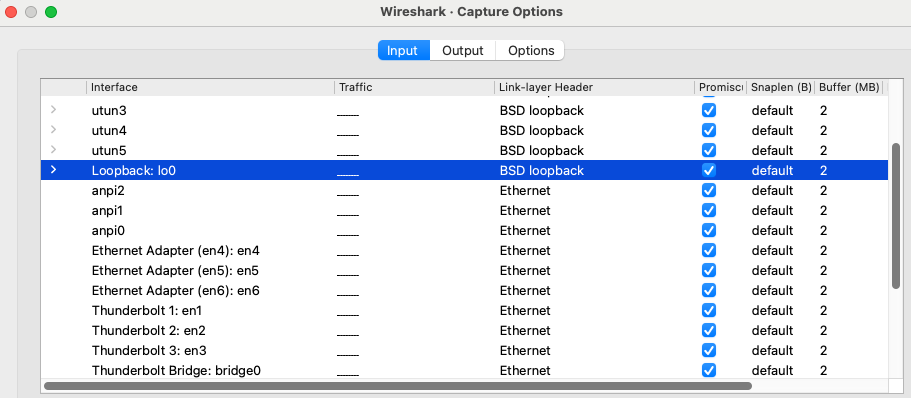

## Lab 4: Let's Exploit a Vulnerable Container! ##

The beauty of containers is that you can configure them to be whatever you want.  From the most secure operating system ever to one fraught with vulnerabilities.  Today, we are going to download a vulnerable container.  It is called Juice Shop and was made vulnerable on purpose - so that folks like you and I may learn or practice our skills.  Its perfect for CTF practice!

Here is a link to Juice Shop:

[Juice Shop](https://github.com/juice-shop/juice-shop)

You can always attempt to install things from scratch - but containers make life so easy.  Here is the URL for a popular Juice Shop container (there is no official release - more on that in a second).

[Docker Hub Juice Shop Container](https://hub.docker.com/r/bkimminich/juice-shop)

If we search DockerHub - we find there are other Juice Shop containers.  Do we trust em', should we trust em'?  It all depends - but more than likely we should **not** trust them.

### Checking Trust of a Container ###
Ok, this a is a bit outside of a capture the flag exercise.  But it is important to know and consider.  It actually can easily be applied to a capture the flag exercise.  We are about to pull the Juice Shop container.  Once we have it - how do we know it itself is not running malware?  Maybe its a bait and switch situation where the maker of the container advertises it as an easy way to install Juice Shop but has then loaded it with malware.  Let's find out what happens.  First, pull the container - like so:

```bash
docker pull bkimminich/juice-shop
```

We will install a set of tools that will allow us to:

1️⃣ Scan the image before running it

2️⃣ Scan the running container

3️⃣ Analyze files and network activity

Install this tool - called Trivy:

```bash
sudo apt install trivy -y
```

Now, let's examine the Docker image we just pulled.  Issue this command:

```bash
trivy image bkimminich/juice-shop
```

We can also run a test with dockle that checks the container for best Docker security practices:

```bash
sudo apt install dockle  # Linux
dockle bkimminich/juice-shop
```

There are other tools we could use to check this container.  For example, this:

[Clam AV](https://www.clamav.net)

We would need to ssh into the container, use ```apt``` to update, and then install ```clamav```.  But - we do not need to.  The container is well known and does not harbor malware.  However, it is **very** vulnerable!  Let's start to exploit it!

## What Is Juice Shop?##

It is the most advanced and (probably) trustworthy open source pen testing applications avaiable.  There is a lot to it.  Let's review the official documentation here:

[Juice Shop Manual](https://pwning.owasp-juice.shop/companion-guide/latest/part1/happy-path.html)

Let's review Part 1: Hacking preparations together.  Note, we cannot access the Score Board as yet - that is part of our first challenge!

Before we move on - we should install a tool to help us out.  In this task and in the future (it will help understand this week's picoCTF).  Install Wireshark.  Who knows what Wireshark is used for?

```bash
sudo apt update
sudo apt install wireshark -y
```

To run Wireshark - use `sudo`.  Otherwise it will not capture the packets.  Once it is started, let's explore what it is doing!

For our assignment today we will want to choose the loopback adapter:



We will also want to filter results to only capture port 3000.  With this filter in the filter bar at top:

```bash
tcp.port == 3000
```


## Challenge 1.  Find the Score Board

Let's find that socreboard! First, we need to start our container.  Run Juice Shop like so:

```bash
docker run --rm -p 3000:3000 bkimminich/juice-shop
```

Note - we have run it interactively.  The container will start and will basically take over the console.  You need to open another tab and access a fresh console.  If we wanted to - we could easily run this as a background process.

Remeber to start recording with Wireshark!

Now - we *cheat* just a little here.  We do not scan the container - only because it takes a long time for the container itself to reply.  Rather, we scan localhost which finds the ports that were punched through between the container and your machine.  Hopefully that makes sense!

Issue the following command and watch the information flow back:

```bash
nmap -p- -A localhost
```

**How Did Nmap Gather All This Diagnostic Info?**

Nmap is incredibly powerful because it doesn’t just **check if ports are open**—it also **interacts with services running on those ports** to fingerprint them and collect detailed diagnostic data. Here's **how Nmap figured out all this information** step by step:

Your command:

```bash
nmap -p- -A localhost
```

told Nmap to:
- `-p-` → **Scan all 65,535 ports**.

- `-A` → Enable **aggressive scan mode**, which includes:
  - **OS detection**
  - **Service version detection**
  - **Script scanning**
  - **Traceroute**

The first thing Nmap does is **send probes to check which ports are open**. This is why you see:
```
Not shown: 65517 closed tcp ports (conn-refused)
```
This means **most ports rejected connections**, but the ones listed were **open**.

### Let's Find the Scoreboard in Juice Shop Using `wget` + `grep`**
This method uses **`wget` to crawl the website** and **`grep` to extract words near "score"**. This is useful because Juice Shop **doesn’t link to the Scoreboard page directly**, so we need to find **hidden references**.


**Step 1: What is `wget` and Why Are We Using It?**

`wget` is a command-line tool that **downloads web pages recursively**, following links just like a browser.

**Why Use `wget`?**

- It **automates browsing** by following links **inside the website**.
- It **saves pages locally**, so we can **search them for hidden clues**.
- It **works even if pages aren’t visible in the UI**.

**Step 2: Use `wget` to Download the Entire Website**

Run this command to **crawl Juice Shop** and save **all accessible pages**:
```bash
wget -r -l 2 -np -k http://localhost:3000
```
### **Explanation of Flags**
| **Flag** | **What It Does?** |
|---------|------------------|
| `-r` | Recursive (follows links) |
| `-l 2` | Limits recursion to 2 levels (**prevents crawling the entire internet!**) |
| `-np` | No parent traversal (stays inside `localhost:3000`) |
| `-k` | Converts links for offline browsing |

This saves files in a folder named `localhost:3000/`.


**Step 3: Use `grep` to Find the Scoreboard Reference**

Since we **don’t know the exact URL**, search for the word **"score"** in the downloaded pages:

```bash
grep -o -E '.{0,20}score.{0,20}' localhost:3000/*
```
### **🔹 Explanation**
| **Command** | **What It Does?** |
|------------|------------------|
| `grep` | Searches for text inside files |
| `-o` | Shows only matching words, not the full line |
| `-E` | Enables extended regex |
| `.{0,20}score.{0,20}` | Shows up to 20 characters before and after "score" |

**Example Output:**

```
... access the score-board ...
... user highest score is 3200 ...
... API endpoint for score-board ...
```
**Now you know the exact URL (probably `/score-board`)** 

Try opening the suspected page in Firefox - what happens?

```bash
http://localhost:3000/score-board
```
No dice with this one.  Ok, but there is that `#` in the initial URL.  What if it we try it that way.

```bash
http://localhost:3000/#/score-board
```
It works!!!

## Simulating Realism ##
Ok, so what have we got here.  A set of directions that gave us the hint to find the ```score-board``` page.  However, its not a separate page.  **`http://localhost/#/score-board`** is not a real page in the traditional sense. Instead, it uses hash-based routing to load the Scoreboard without making a new request to the server.

**What is `/#/score-board` Doing?**

- The `#` (hash) symbol is used for **client-side routing** in Single Page Applications (SPAs).
- It does NOT trigger an HTTP request to `/score-board` on the server.
- Instead, the **JavaScript framework (Angular)** listens for changes in the URL fragment (`#/score-board`) and dynamically renders the correct view.

**How It Works in Juice Shop**

1️⃣ You visit `http://localhost:3000/`.  
2️⃣ The browser loads one HTML file (`index.html`) and JavaScript.  
3️⃣ When you navigate to `http://localhost/#/score-board`, JavaScript detects the `#/score-board` part and:

   - **Finds the correct route in Angular’s router**.
   - **Loads the Scoreboard view dynamically**.
   - **Updates the page content without a full reload**.

This means `/score-board` doesn’t exist as an actual backend route! Instead, it's just a state change inside the frontend framework.


**How to Find the JavaScript Controlling This?**

Let's go to the developer tools within Firefox on the Juice Shop landing page.  We see the following:


We are interested in the `Debugger` tab.  You will see a tree structure to the left.  It lists out the following:

| **File Type** | **What It Does?** |
|--------------|------------------|
| `index.html` | The main HTML structure (contains placeholders for JavaScript to modify) |
| `main.js` | The app’s core JavaScript logic (handles routing, user interactions, API calls) |
| `vendor.js` | Third-party libraries (like Angular, Express, or authentication modules) |
| `runtime.js` | Bootstraps the JavaScript execution (optimizes how the app loads) |
| `polyfills.js` | Fills in missing features for older browsers |

So we know that `main.js` has logic in it.  And we know it renders things with `\#\`.  Can we find other pages it might render we have not seen?  If you click on `main.js`, it will show the content on one line.  Be sure to right click and wrap the text.

Find another interesting page (or view rather!).